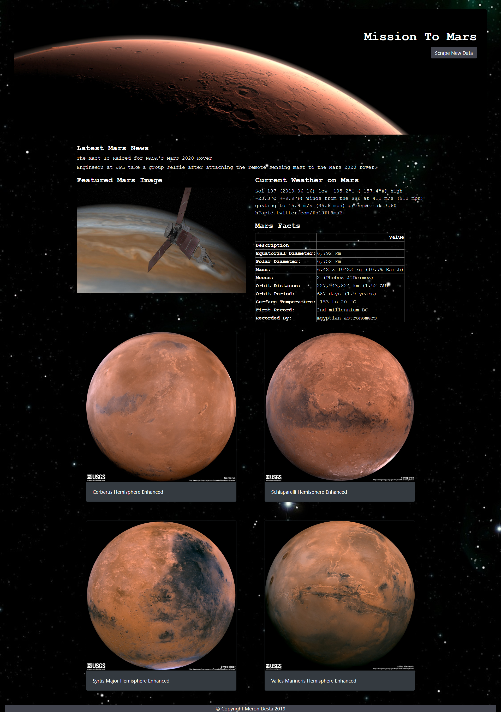

# Mission To Mars 

For this assignment, I scrapped data from various websites for data related to the Mission to Mars and displays the information in a single HTML page. The initial scrapping was completed using Notebook, BeautifulSoup, Pandas, and Requests/Splinter. 

Once I was able to scrape the information needed, I converted the Jupyter notebook into a Python script called "scrape_mars.py" with a function called scrape that executes all of your scraping code and return one Python dictionary containing all of the scraped data.

Next, I created a route called "/scrape" that will import your scrape_mars.py script and call the scrape function. THe return value was stored in Mongo as a Python dictionary. I also created a root route / that will query your Mongo database and pass the mars data into an HTML template to display the data.

Finally, I created a template HTML file called index.html that will take the mars data dictionary and display all of the data in the appropriate HTML elements.

Data Sources:

Mars News - [NASA Mars News Site](https://mars.nasa.gov/news/)
Featured Mars Image -[NASA Mars Image Website](https://www.jpl.nasa.gov/spaceimages/?search=&category=Mars)
Mars Weather - [Mars Weather Twitter Account](https://twitter.com/marswxreport?lang=en)
Mars Facts - [Mars Facts webpage](https://space-facts.com/mars/)
Mars Hemispheres - [USGS Astrogeology](https://astrogeology.usgs.gov/search/results?q=hemisphere+enhanced&k1=target&v1=Mars)

Screeen Capture of webpage:

